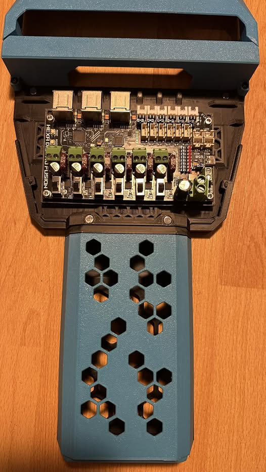

# Fysetc Hexa distro fusion holder for StealthChanger

I had to widen (by 15mm to each side) the existing base, cover, PTFE ramps and cover ramp for n3mi's umbilical plates, as this board is really big and it could not fit the existing FannyPack.

## BOM
4x voron heatset inserts

Rest of stuff needed to build FannyPack

Optional: 90° USB-C cable or adapter, as it is really tough with some cables to bend them

### Credits
[DraftShift Design] (https://github.com/DraftShift) for the original FannyPack

[Fysetc] (https://github.com/FYSETC/Hexa_Distro_Fusion) for releasing the drawings for the board

### History
v2 - moved the holes bit to the side, so there is more room for the USB-C cable